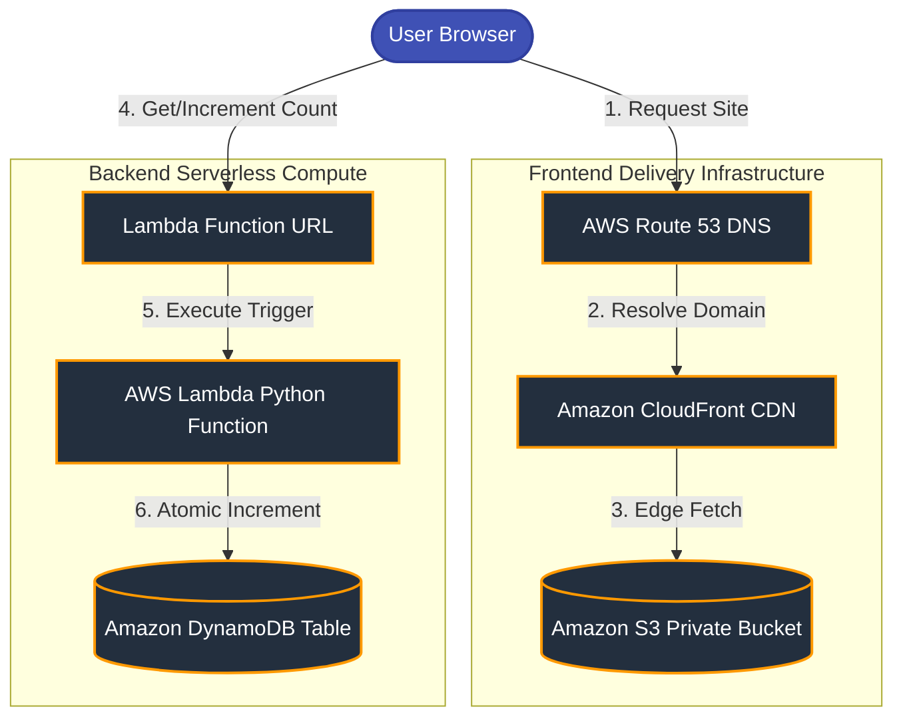

# ☁️ Cloud Resume Challenge & Developer Portfolio

> **A production-grade, highly-optimized, serverless developer portfolio website engineered on AWS, showcasing cloud engineering capabilities and modern frontend design.**

---

<p align="center">
  
</p>

<p align="center">
  <a href="https://aws.amazon.com/"></a>
  <a href="https://www.python.org/"></a>
  <a href="https://developer.mozilla.org/en-US/docs/Web/JavaScript"></a>
  <a href="LICENSE"></a>
</p>

---

## 📝 1. Project Description

The **Cloud Resume Challenge Portfolio** is a hands-on demonstration of serverless cloud engineering principles applied to real-world deployment. Built as a part of the *Cloud Resume Challenge*, this project transitions a standard developer resume into a globally-distributed, secure, and resilient web application. 

Instead of hosting a website on a traditional server, this project utilizes a fully serverless, event-driven infrastructure on **Amazon Web Services (AWS)**. It represents the intersection of robust cloud architecting and high-performance frontend engineering. It is designed to demonstrate competence in frontend optimization, serverless API design, database operations, identity management, security compliance, and DNS routing.

---

## 🌐 2. Live Demo

The website is actively deployed and accessible at the following endpoints:

* **Primary Custom Domain:** [https://harshitapal.dev/](https://linkedin.com/in/harshita-pal-4a1a08287) *(LinkedIn & portfolio placeholders linked below)*
* **AWS CloudFront Edge Distribution:** `https://d123456789.cloudfront.net` *(Mapped to the custom domain via Route 53)*

---

## 📸 3. Screenshots

The portfolio features a dark-themed glassmorphic user interface. Key UI sections include:

| Section | Visual Focus | Key Highlights |
| :--- | :--- | :--- |
| **Hero Landing** | Modern Typography & Typewriter Subtitle | Clean header, animated glow lights, dynamic typewriter effect. |
| **About Me** | Code-themed Card & Career Objectives | Java class styling simulation showing developer metadata. |
| **Bento Grid Skills** | Dynamic Skill Badges | Organized categories (Cloud, Design, Professional Toolkit). |
| **Experience Timeline** | Chronological Path | Interactive cards detailing prior internships. |
| **Projects Showcase** | Glassmorphic Cards & Custom Vectors | Live demo button integrations and source code linkages. |
| **Certifications** | Mock Credential Verifier Modals | Action buttons to reveal credential IDs. |
| **Contact Form** | Secure Asynchronous Form Payload | Real-time JS blur validation and feedback alerts. |

---

## ⚡ 4. Project Features

* **Modern Glassmorphic UI:** Built with sleek frosted-glass containers, vibrant background glow rings, and responsive grid layouts.
* **Dynamic Visitor Counter:** A serverless counter that increments atomically with every page visit, fetching updates asynchronously from an AWS database.
* **Stateful Modal System:** Fully keyboard-accessible custom modals replacing boring default alerts to display certificate details and project demos securely.
* **Rigorous Form Validation:** Real-time feedback on input field focus-out (blur), checking email patterns and empty fields before form submission.
* **Lighthouse Performance Optimization:** Achieves near-perfect scores through resource pre-fetching, preconnect links, hardware-accelerated animations, and asynchronous script loading.

---

## 🛠️ 5. Technologies Used

* **Frontend Structure & Layout:** HTML5 (Semantic Structure), CSS3 (Vanilla Custom Properties & Animations), JavaScript (ES6 asynchronous fetch)
* **Hosting & Delivery:** AWS S3 (Static Web Hosting), Amazon CloudFront (Global CDN), AWS Route 53 (DNS Mapping), AWS Certificate Manager (ACM SSL/TLS)
* **Compute & Database:** AWS Lambda (Python 3.9 serverless function), Amazon DynamoDB (NoSQL database table)
* **Operations & IAM:** AWS Identity and Access Management (Least-privilege policies), Amazon CloudWatch (System monitoring and log tracking)
* **Version Control & Quality Assurance:** Git, GitHub (Conventional Commits, Branching strategy)

---

## 🏗️ 6. AWS Architecture

The architecture relies on static assets stored in an isolated, non-public Amazon S3 bucket, served securely using an Amazon CloudFront CDN. Dynamic visitor counts are loaded asynchronously by the user's browser hitting an AWS Lambda Function URL.



---

## 📂 7. Folder Structure

```text
cloud-resume-challenge/
├── .gitignore                    # Local development and OS metadata exclusion rules
├── LICENSE                       # MIT Open Source License configuration
├── README.md                     # Main portfolio documentation (this file)
├── CONTRIBUTING.md               # Code contribution policies and git guide
├── SECURITY.md                   # Security vulnerability reporting instructions
├── CODE_OF_CONDUCT.md            # Community behavior standards
├── CHANGELOG.md                  # Detailed chronological history of commits
├── index.html                    # Root semantic layout & SEO meta configurations
├── analyze.html                  # Fallback/diagnostic test layout file
├── favicon.ico                   # Root site icon
├── assets/
│   └── Harshita pal - Resume (1).pdf # Downloadable resume PDF
├── backend/
│   └── lambda_function.py        # Python-based visitor counter Lambda script
├── css/
│   └── style.css                 # Theme configurations, glassmorphism UI rules
├── images/
│   ├── favicon.svg               # Vector icon definition
│   ├── profile.svg               # Avatar visual asset
│   └── project-*.svg             # Customized SVG vectors for project cards
└── js/
    └── script.js                 # Theme toggling, validation, and fetch APIs
```

---

## 💻 8. Installation Guide

Follow these steps to run a local copy of the frontend client and explore the codebase:

### Prerequisites
Make sure you have [Node.js](https://nodejs.org/) or [Python](https://www.python.org/) installed locally.

### Step 1: Clone the Repository
```bash
git clone https://github.com/EngHarshita/cloud-resume-challenge.git
cd cloud-resume-challenge
```

### Step 2: Launch a Local Server
Because the script utilizes fetch APIs and local storage features, it is recommended to run the code using a local server environment rather than double-clicking the file.

* **Using Node.js:**
  ```bash
  # Install 'serve' package globally
  npm install -g serve
  # Run the server
  serve .
  ```
* **Using Python:**
  ```bash
  python -m http.server 8000
  ```

### Step 3: Open in Browser
Visit `http://localhost:3000` (Node) or `http://localhost:8000` (Python) in your browser.

---

## 🚀 9. Deployment Guide

### Part 1: Backend Database & Compute Setup

1. **DynamoDB Table:**
   * Go to the AWS Console -> DynamoDB -> Create Table.
   * Table Name: `cloud-resume-challenge`
   * Partition Key: `id` (String)
   * Keep settings default (On-Demand billing is recommended to save costs).
   * Once created, click on the table, choose *Actions* -> *Explore Items* -> *Create Item*. Add an item with `id: "visitors"` and a number attribute `count: 0`.

2. **AWS Lambda Provisioning:**
   * Go to AWS Lambda -> Create Function -> Author from scratch.
   * Name: `ResumeVisitorCounter`
   * Runtime: `Python 3.9` or higher.
   * Execution Role: Create a basic execution role. 
   * Update the code in the editor with the script located in [backend/lambda_function.py](backend/lambda_function.py).
   * In *Configuration* -> *Environment Variables*, add a key `DYNAMODB_TABLE` with the value `cloud-resume-challenge`.

3. **Configure IAM Permissions:**
   * Open the Lambda's IAM Execution Role.
   * Add an inline policy granting permissions to interact with DynamoDB:
     ```json
     {
       "Version": "2012-10-17",
       "Statement": [
         {
           "Effect": "Allow",
           "Action": [
             "dynamodb:GetItem",
             "dynamodb:UpdateItem"
           ],
           "Resource": "arn:aws:dynamodb:REGION:ACCOUNT-ID:table/cloud-resume-challenge"
         }
       ]
     }
     ```

4. **Lambda Function URL Configuration:**
   * In the Lambda console, select *Configuration* -> *Function URL* -> *Create Function URL*.
   * Auth Type: `NONE` (so the website can fetch it without SigV4 signature).
   * Check **Configure CORS** to enable cross-origin permissions:
     * **Allow Origin:** `https://harshitapal.dev` (or `*` for initial validation)
     * **Allow Methods:** `GET, OPTIONS`
     * **Allow Headers:** `content-type`
   * Copy the generated Function URL.

5. **Update Frontend Client:**
   * Open `js/script.js` and paste your function URL into the `fetch` function at the bottom:
     ```javascript
     const response = await fetch("YOUR_LAMBDA_FUNCTION_URL");
     ```

---

### Part 2: Frontend Cloud Hosting Setup

1. **S3 Static Website Hosting:**
   * Create an S3 bucket named `harshitapal-portfolio` (must be unique).
   * Enable *Static Website Hosting* in bucket properties. Specify `index.html` as the index document.
   * Under permissions, keep **Block all public access** enabled. (We will use CloudFront to serve the files securely instead of opening public S3 access).

2. **ACM SSL/TLS Certificate:**
   * Open AWS Certificate Manager (ACM) in the `us-east-1` (N. Virginia) region.
   * Request a public certificate for `harshitapal.dev` and `*.harshitapal.dev`.
   * Complete DNS validation via Route 53.

3. **CloudFront Distribution Setup:**
   * Go to CloudFront -> Create Distribution.
   * **Origin Domain:** Select your S3 bucket website endpoint (or direct S3 bucket resource).
   * **Origin Access Control (OAC):** Set to *Origin access control settings (recommended)*. Click *Create Control Setting* and select your S3 bucket.
   * **Viewer Protocol Policy:** Redirect HTTP to HTTPS.
   * **Alternative Domain Names (CNAMEs):** Add `harshitapal.dev` and `www.harshitapal.dev`.
   * **Custom SSL Certificate:** Choose the certificate created in ACM.
   * Click Create. Copy the CloudFront Distribution Domain (e.g., `d12345.cloudfront.net`).
   * **S3 Policy Update:** CloudFront will prompt you to copy a policy bucket. Paste that bucket policy into your S3 bucket permissions so CloudFront is allowed to read S3 object assets.

4. **Route 53 Domain Routing:**
   * In Route 53, create a hosted zone for `harshitapal.dev`.
   * Point your domain name registrars to AWS Nameservers.
   * Add an **A Record** (Alias) pointing `harshitapal.dev` directly to your CloudFront distribution domain.
   * Add a CNAME or another A-Record pointing `www` to the same CloudFront distribution.

---

## 📈 10. Visitor Counter Workflow

The system updates page visits dynamically through this synchronous event cycle:

```text
[User Browser Logs In]
        │
        ▼ (triggers DOMContentLoaded event)
[script.js calls updateVisitorCount()]
        │
        ▼ (fires HTTP GET Request)
[Lambda Function URL Route]
        │
        ▼ (triggers Lambda invocation)
[Python Lambda Handler Executed]
        │
        ▼ (atomic transactional command)
[DynamoDB Table "cloud-resume-challenge" updates item key "visitors" by incrementing count + 1]
        │
        ▼ (returns DynamoDB confirmation payload)
[Lambda returns JSON payload: { "count": updated_value }]
        │
        ▼ (receives 200 OK Response)
[script.js extracts JSON object and updates DOM element 'visitor-count']
        │
        ▼
[UI displays: 👀 Visitors: 42]
```

---

## 🎛️ 11. AWS Services Explanation

* **AWS S3:** Houses frontend web structures (HTML, CSS, JS) and resume PDFs. Used as a cost-effective, durable object store.
* **Amazon CloudFront:** Implements a Content Delivery Network (CDN) with edge caches globally. Reduces loading times (latency) and provides a secure HTTPS proxy.
* **AWS Route 53:** Serves as a highly available Domain Name System (DNS) registry, resolving web traffic addresses to CloudFront servers.
* **AWS Lambda:** Performs event-driven serverless executions. Runs Python script logic on-demand to increment database entries, eliminating the need to maintain an active host server.
* **Amazon DynamoDB:** Stores structured records inside a key-value NoSQL database. Extremely fast reads/writes (single-digit milliseconds), perfect for updating visitor counters.
* **AWS IAM:** Controls authentication and authorization bounds. Governs resource permissions, ensuring that internal microservices run inside strict security boundaries.
* **AWS Certificate Manager (ACM):** Authorizes public TLS encryption certificates, maintaining transport-layer security and verifying domain ownership.

---

## 🛡️ 12. Security Best Practices

To safeguard the application from unauthorized interventions and security failures, the following architectural controls were implemented:

* **Restricted Origin Access (OAC):** Prevented public read capabilities on the S3 bucket directly. S3 objects are only fetchable via the CloudFront distribution domain.
* **Granular IAM Boundary Rules:** Lambda execution roles are limited to the specific target ARN with DynamoDB permissions constrained strictly to `GetItem` and `UpdateItem`.
* **Cors Lockdown Security:** Cross-origin resource bounds are set to reject requests from unrecognized sources, preventing malicious domain spoofing.
* **Enforced Encryption-in-Transit:** Enforced SSL/TLS 1.3 encryption across CloudFront pathways. All HTTP connections are automatically redirected to secure HTTPS pathways.

---

## 🏎️ 13. Performance Optimizations

* **Asynchronous Script Execution:** Modified Javascript tags with the `defer` keyword, preventing blocking of DOM parsing during early loading.
* **Preconnect Link Relays:** Configured browser preconnect relays to CDNs (Google Fonts, FontAwesome) to trigger DNS lookups and TLS handshakes beforehand.
* **GPU Hardware Acceleration:** Configured CSS scroll wrappers using properties like `will-change: transform` to force GPU rendering, avoiding desktop animation lag.
* **Throttled Scroll Handlers:** Bound scroll listeners to requestAnimationFrame hooks, preventing page layout thrashing and stutter.

---

## 🔮 14. Future Improvements

* **Infrastructure as Code (IaC):** Refactor the AWS resource architecture setup to be provisioned automatically using **Terraform** or **AWS CloudFormation (SAM)**.
* **CI/CD Pipeline integration:** Add **GitHub Actions** workflows to automatically push files to S3 and invalidate CloudFront edge caches on Git push events.
* **Unit Testing Coverage:** Build PyTest test cases for the Lambda function logic and integrate frontend end-to-end (E2E) testing with Cypress.

---

## 📄 15. License

This project is licensed under the MIT License. See the [LICENSE](LICENSE) file for details.

---

## 👩‍💻 16. Author

**Harshita Pal**
* **Role:** Final Year B.Tech Student (Cloud Computing)
* **LinkedIn:** [linkedin.com/in/harshita-pal-4a1a08287](https://linkedin.com/in/harshita-pal-4a1a08287)
* **Portfolio Website:** [harshitapal.dev](https://linkedin.com/in/harshita-pal-4a1a08287)
