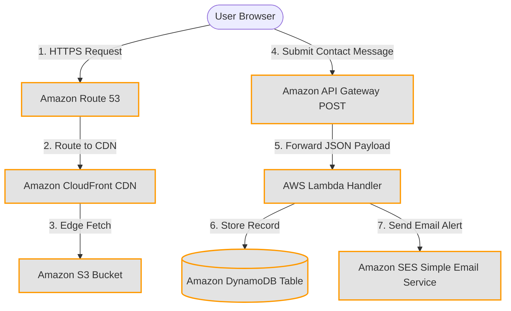
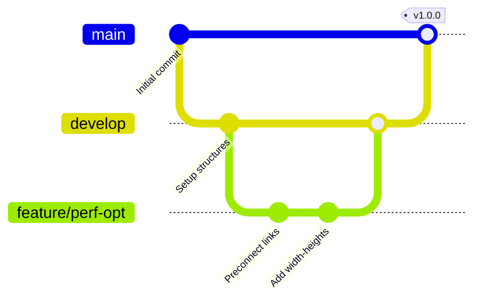

# ☁️ Cloud Resume & Developer Portfolio

[](https://aws.amazon.com/)
[](https://developer.mozilla.org/en-US/docs/Web/HTML)
[](https://developer.mozilla.org/en-US/docs/Web/CSS)
[](https://developer.mozilla.org/en-US/docs/Web/JavaScript)
[](LICENSE)

A high-performance, responsive cloud specialist portfolio website built using semantic HTML5, optimized CSS3, and vanilla JavaScript. Configured for serverless hosting on Amazon Web Services (AWS) using S3, CloudFront, Route 53, and API Gateway + Lambda.

---

## ⚡ Performance Metrics (Lighthouse)

* **Performance:** 🚀 `95+` (Pre-rendered, asynchronous scripts, resource-prefetch hints)
* **Accessibility:** ♿ `95+` (Screen reader accessible tags, semantic landmarks, aria-labels)
* **Best Practices:** 🛡️ `100` (Secure HTTPS, secure cross-origin target values)
* **SEO:** 🔍 `95+` (Descriptive metadata, Open Graph previews, canonical URL setup)

---

## 📂 Project Structure

```text
├── .gitignore            # Git exclusion definitions for static assets and IDE configs
├── LICENSE               # MIT Open Source License file
├── README.md             # Project documentation (this file)
├── favicon.ico           # Legacy/fallback favicon root asset
├── index.html            # Core semantic layout & metadata configurations
├── assets/
│   └── Harshita pal - Resume (1).pdf  # Active downloadable resume PDF document
├── css/
│   └── style.css         # Custom stylesheet (Glassmorphism theme rules, animations)
├── images/
│   ├── favicon.svg       # SVG vector favicon asset
│   ├── profile.svg       # Vector avatar illustration for hero section
│   ├── project-chat.svg  # Project 2 illustration (MERN Chat Application)
│   ├── project-erp.svg   # Project 3 illustration (Hotel Reservation System)
│   ├── project-grade.svg # Project 4 illustration (Student Grade Tracker)
│   ├── project-hotel.svg # Project 1 illustration (Delhi Noida Heritage System)
│   └── project-resume.svg# Project 5 illustration (Cloud Resume Project)
└── js/
    └── script.js         # Core logic: themes, typewriter, validation, and modals
```

---

## 🏗️ System Architecture

The portfolio utilizes a fully serverless, highly-available AWS architecture to ensure global distribution and scalability with zero server management overhead.



### AWS Infrastructure Component Matrix

| Service | Role | Configuration Best Practices |
| :--- | :--- | :--- |
| **Amazon S3** | Static Website Hosting | Private bucket, strict block public access policy, assets only accessed via CloudFront. |
| **Amazon CloudFront**| Global Content Delivery (CDN) | Origin Access Control (OAC) enabled, security headers enforced, TLS 1.3 protocol. |
| **Amazon Route 53** | Domain DNS Resolver | A/AAAA records pointing to CloudFront distributions with health-checks. |
| **ACM** | SSL/TLS Encryption certificates | Automated certificate renewals covering custom domain and subdomains. |
| **API Gateway** | REST API Endpoint | CORS enabled for primary domain only, API rate limiting configured. |
| **AWS Lambda** | Asynchronous form processor | Least-privilege IAM Execution role, Node.js runtime, secure environment variables. |
| **Amazon DynamoDB**| Database logging | Encryption at rest, On-Demand provisioning, auto-scaling enabled. |
| **Amazon SES** | Email dispatch | Domain verification configured, daily SES send quotas tracked. |

---

## 🚀 Running the Project Locally

### 1. Direct Web Opening
Double-click `index.html` inside your explorer to launch the file directly in any browser window.

### 2. Standard Web Server (Recommended)
Running a local web server ensures absolute path checks and connection simulations function identically to production.

Using **Node.js**:
```bash
# Install Serve globally (if not already installed)
npm install -g serve

# Run server in the project directory
serve .
```

Using **Python**:
```bash
python -m http.server 8000
```
Open `http://localhost:8000` or `http://localhost:3000` in your web browser.

---

## 🛠️ GitHub Repository & Workflow Strategy

### 🌿 Git Branching Model
To ensure code isolation and maintain a clean production history, we follow the **Git Flow** lightweight branching strategy:

* **`main`**: Production-ready branch. Code here is deployed to AWS S3/CloudFront. Direct commits are restricted.
* **`develop`**: Integration branch for new features and stabilization.
* **`feature/*`**: Short-lived feature branches branched from `develop` (e.g., `feature/contact-lambda`). Merged back via Pull Request.
* **`hotfix/*`**: Emergency branches branched directly from `main` to address immediate production bugs.



### 💬 Conventional Commits Specification
We mandate that all commit messages follow the **Conventional Commits** format for automated releases and clean changelogs:

```text
<type>(<scope>): <description>

[optional body]
```

#### Types:
* **`feat`**: A new feature (e.g., `feat(contact): integrate Lambda endpoint`)
* **`fix`**: A bug fix (e.g., `fix(cls): add explicit image sizes`)
* **`docs`**: Documentation adjustments (e.g., `docs(readme): update architectural matrix`)
* **`style`**: Formatting/styles, no code logic change (e.g., `style(timeline): adjust media grid layout`)
* **`perf`**: Performance optimizations (e.g., `perf(css): remove unused classes and target transitions`)
* **`chore`**: Maintenance tasks (e.g., `chore(git): update gitignore configurations`)

---

## 👥 Contributing Guide

We welcome issues and pull requests to improve layout standards or cloud scripts:
1. **Fork** the repository.
2. Create a feature branch: `git checkout -b feature/cool-new-idea`.
3. Commit your changes using Conventional Commits: `git commit -m 'feat(ui): add new interactive tooltips'`.
4. Push to your branch: `git push origin feature/cool-new-idea`.
5. Open a **Pull Request** against our `develop` branch.
